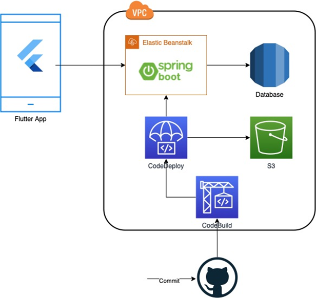

# fiap-fase03

Projeto para Sprint 3 para o MBA de Enharia de Software FIAP.

## Executar o projeto

* Execute o script [startMySql.hs](scripts/startMysql.sh) para dar start no MySQL (esta usando o build para M1)
* Execute a classe [AbcTechServiceApplication](src/main/java/br/com/fiap/abctechservice/AbcTechServiceApplication.java) para executar o projeto do backend;
* Atente ao [script](/Users/leandrofranchi/work/projects/lfr/fiap-fase03/scripts/testApiCall.sh) com exemplos e caso seja primeira execução, execute a chamada da API para criação do usuário.

## Problemas a serem resolvidos pela Solution Sprint

| Problema                                                                                                                                                    | Observações                                                                                                                                              | Responsável Back | Status Back                           | Responsável Front | Status Front                        |
|-------------------------------------------------------------------------------------------------------------------------------------------------------------|----------------------------------------------------------------------------------------------------------------------------------------------------------|------------------|---------------------------------------|-------------------|-------------------------------------|
| Aplicativo não captura informação de geolocalização ao início e término de serviço, possibilitando que o prestador não compareça para prestação do serviço. | 1. Mapear ORM com info de Location nas Ordens.  2. Disponibilizar REST para criação da Ordem.4. Fazer a chamada do Frontend para salvar atendimento. | Leandro          | DONE |                   | TODO |          
| Reclamação dos prestadores, aplicativo lento e que descarrega o celular rapidamente. Com isso, muitos ainda acabam utilizando fichas e recibos físicos.     |                                                                                                                                                          |                  | TODO   |                   | TODO |     
| É complexo para adicionar os serviços realizados e a ordem.                                                                                                 |                                                                                                                                                          |                  | TODO   |                   | TODO |
| O sistema não gera relatório do tempo gasto para realização do serviço.                                                                                     |                                                                                                                                                          |                  | TODO   |                   | TODO |
| Ao finalizar, o serviço não exige nenhuma confirmação do cliente.                                                                                           |                                                                                                                                                          |                  | TODO   |                   | TODO |

## Premissas a serem resolvidos pela Solution Sprint

| Premissa                                                                                                  | Observações                                                                                                                                    | Responsável Back | Status Back                            | Responsável Front | Status Front                           |  
|-----------------------------------------------------------------------------------------------------------|------------------------------------------------------------------------------------------------------------------------------------------------|------------------|----------------------------------------|-------------------|----------------------------------------|
| Sistema deve ser rápido e escalável.                                                                      | Deverá ser executado em container na AWS.                                                                                                      |                  | TODO    |                   | TODO    |
| O aplicativo deve funcionar em Android, iOS e Web.                                                        | Resolvido pela tuilização do Flutter.                                                                                                          |                  | TODO    |                   | TODO    |
| O aplicativo identificará o prestador por um código numérico.                                             | Criar atributo de Id para o Operador.                                                                                                          | Leandro          | DONE  |                   | TODO    |
| O aplicativo deverá contar com uma lista de serviços prestados.                                           | Cadastro de Assitencias.                                                                                                                       | Leandro          | DONE  |                   | TODO    |
| Cada ordem deverá ter ao menos 1 serviço prestado e poderá ter até 15 serviços realizados.                | Ciar handler de validação no backend.                                                                                                          | Leandro          | DONE  |                   | TODO    |
| O aplicativo deverá gravar a hora e geolocalização ao iniciar o atendimento.                              | 1. Frontend chama Rest de criacão da Ordem. 2. Backend salva as informações. (Utiliza o mesmo serviço de save do backend).                 | Leandro          | DONE  |                   | TODO    |
| O aplicativo deverá gravar a hora e geolocalização ao finalizar o atendimento.                            | 1. Frontend chama Rest de finalização de ordem. 2. Backend Atualiza as informações da Ordem. (Utiliza o mesmo serviço de save do backend). | Leandro          | DONE  |                   | TODO    |
| Ao finalizar, todas essas informações devem ser enviadas para o servidor e gravadas em um banco de dados. | Parece que é o mesmo item anterior. (Utiliza o mesmo serviço de save do backend).                                                              | Leandro          | DONE  |                   | TODO    |

## Desenho da Solução

## Entregáveis

| Entregável                                                                                                                                | Observações | Responsável | Status                              |
|-------------------------------------------------------------------------------------------------------------------------------------------|-------------|-------------|-------------------------------------|
| Apresentação com quais requisitos serão desenvolvidos na POC do aplicativo (lembrando que, na live, desenvolveremos todos os requisitos). |             |             | TODO | 
| Print do pipeline executado no CI/CD da aplicação.                                                                                        |             |             | TODO |    
| O código de backend desenvolvido em Springboot com os testes unitários em ao menos 30% das features.                                      |             | Leandro     | WIP |
| O código front-end desenvolvido em Flutter/Dart com os requisitos descritos na apresentação.                                              |             | Thiago      | WIP | 

